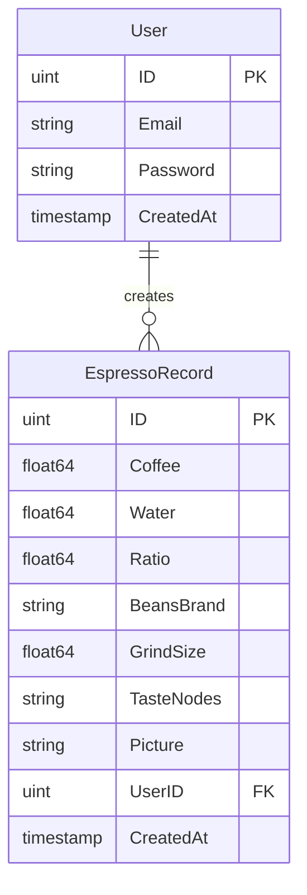
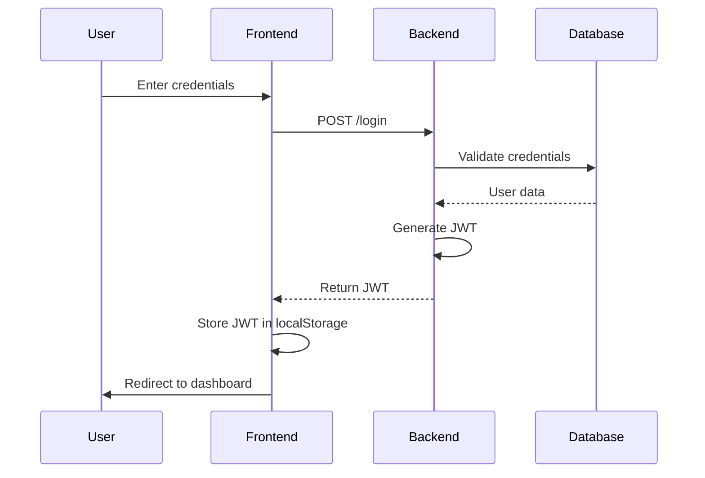

# Coffee Ratio Tracker

A web application for tracking and analyzing coffee brewing ratios, helping coffee enthusiasts perfect their brew.

## Features

- User authentication and authorization
- Track coffee-to-water ratios
- Record coffee bean details and grind sizes
- Taste profile tracking
- Image upload for coffee shots
- Responsive and modern UI

## Tech Stack

- Backend: Go with Gin framework
- Database: PostgreSQL
- Frontend: HTML, CSS, JavaScript
- Authentication: JWT-based authentication
- ORM: GORM

## Database Schema



## Authentication Flow



## API Endpoints

### Authentication
- `GET /login` - Login page
- `POST /login` - Authenticate user
- `GET /signup` - Registration page
- `POST /register` - Create new user

### Protected Routes
- `GET /` - Dashboard (recent records)
- `GET /records` - All records
- `GET /api/records` - API endpoint for records
- `POST /records` - Create new record

## Environment Variables

```env
DB_HOST=localhost
DB_USER=your_db_user
DB_PASSWORD=your_db_password
DB_NAME=coffee_tracker
DB_PORT=5432
```

## Project Structure

```
coffee-tracking-app/
├── main.go                 # Application entry point
├── pkg/
│   └── auth/              # Authentication package
│       ├── auth.go        # Core authentication logic
│       └── validation.go  # Input validation
├── templates/             # HTML templates
│   ├── index.html        # Main dashboard
│   ├── login.html        # Login page
│   └── signup.html       # Registration page
└── static/               # Static assets
```

## Security Features

- JWT-based authentication
- Password hashing with bcrypt
- Input validation
- Secure token storage
- Protected routes
- XSS prevention
- CSRF protection

## Getting Started

1. Clone the repository
2. Set up environment variables
3. Initialize the database
4. Run the application:
   ```bash
   go run main.go
   ```

## Contributing

1. Fork the repository
2. Create your feature branch
3. Commit your changes
4. Push to the branch
5. Create a new Pull Request

## License

This project is licensed under the MIT License - see the LICENSE file for details.
